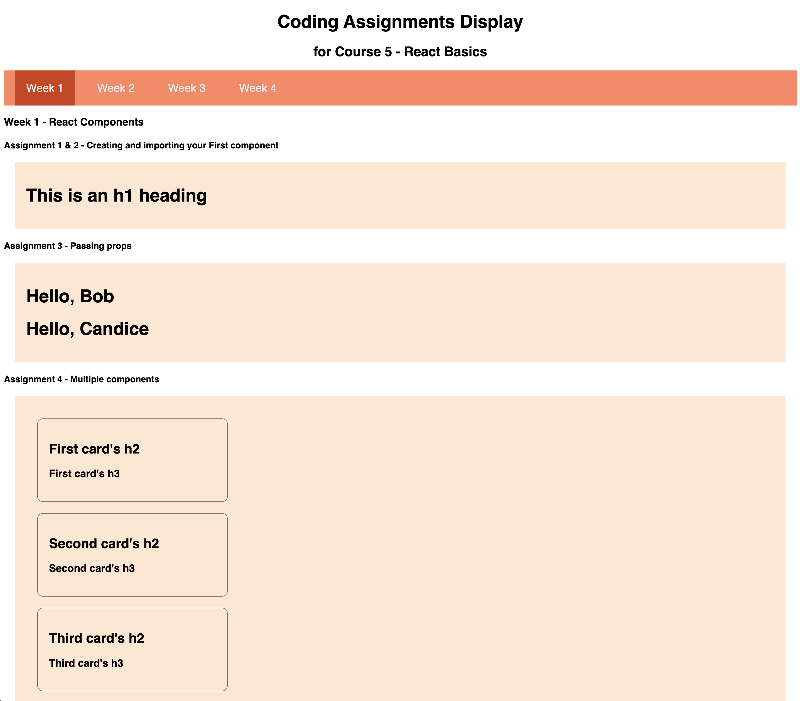
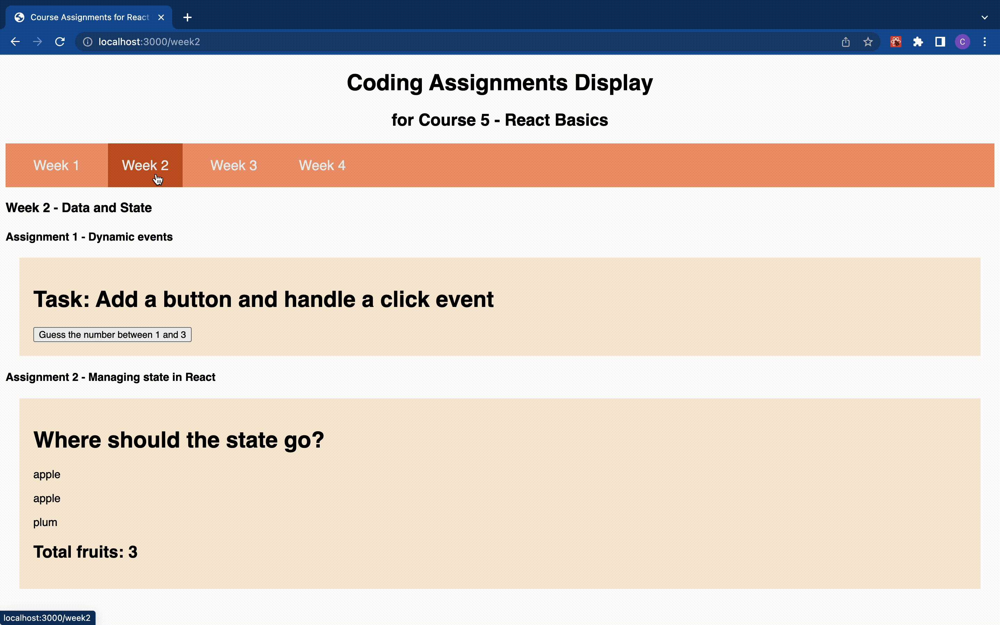

# [Course 5 - React Basics](https://www.coursera.org/learn/react-basics/)

_This course is part of the [Front-End Development Certificate](https://www.coursera.org/professional-certificates/meta-front-end-developer) offered by Meta._

## Course Summary

- Introduction of Single page web appllications and the React libary
- React project structure and JSX
- Manipulate Data, event handling and dynamic states
- Multi-page navigation and conditional rendering dynamic contents

## Skills

- Functional components, JSX and conditional rendering
- State management: useState, useContext, useReducer
- Navigation and routing
- Media elements

**Coding assignment results are shown below in screenshots.**

## Week 1 - [React Components]()

## Week 2 - [Date and State]()

## Week 3 - [Navigation, Updating and Assets in React]()

## Week 4 - [Your first React app]()

