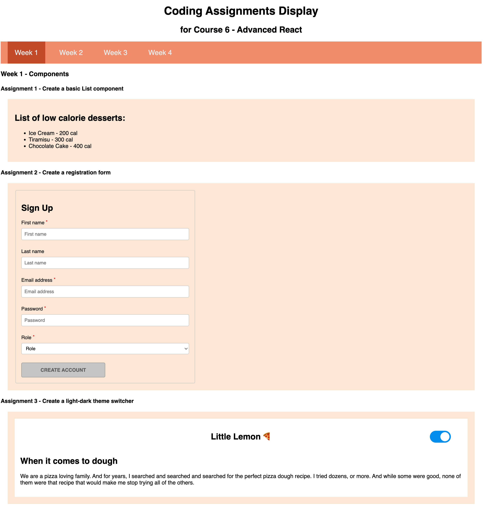

# [Course 6 - Advanced React](https://www.coursera.org/learn/advanced-react?specialization=meta-front-end-developer)

_This course is part of the [Front-End Development Certificate](https://www.coursera.org/professional-certificates/meta-front-end-developer) offered by Meta._

## Course Summary

- Different types of React components
- Advanced and custom hooks
- Render lists and form components efficiently in React
- Explore component composition, such as Higher Order Components and Render and Children Props
- Create a web application that consumes API data and get familiar with the most commonly used React framework integrations, tools, and testing techniques

## Skills

- Advanced React skills:

  - Lift shared state up when several components need the updated data
  - Leverage React Context to share global state for a tree of components
  - Fetch data from a remote server
  - Use of advanced and build custom hooks in React
  - Component composition techniques
  - Use advanced patterns to encapsulate common behavior via Higher Order Components and Render Props

- Jest Unit Testing
- Formik and Yup
- JSX
- HTML, CSS and JavaScript
- Git version control

**Coding assignment results are shown below in screenshots.**

## Week 1 - Components

## Week 2 - React Hooks and Custom Hooks

## Week 3 - JSX and Testing

## Week 4 - Porfolio Website (Graded assessment)

