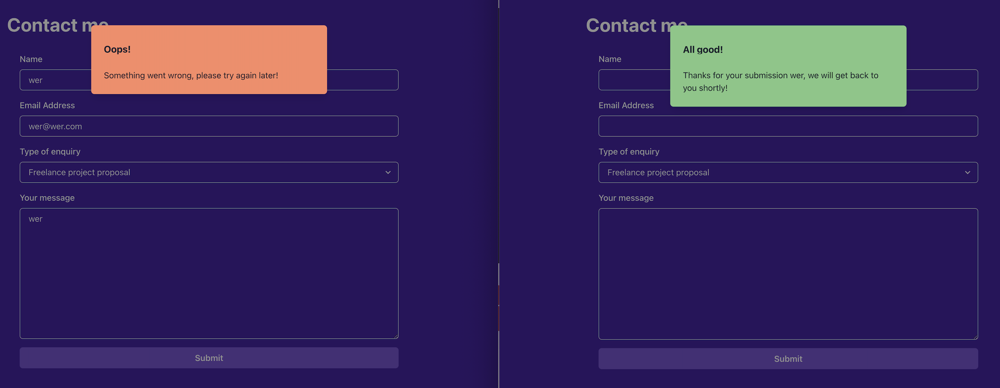

# Porfolio website

Final assignment for Advanced React course.

## Features

Header Section

- Header navbar has links to github and other websites
- Header navbar has in-page anchor of "Projects" and "Contact Me"
- _(bonus!)_ Header navbar will hide / show according to page scrolling down / up.

Fullscreen Landing-page & Projects Section

- layout as required

Contact Form

- Implemented validation schema with Yup
- Show validation message when user typed incorrect data
- Submit button shows spinner during form submission
- Show alert modal to display submission result and clear form upon success

_Screenshots of form submission alert box._
