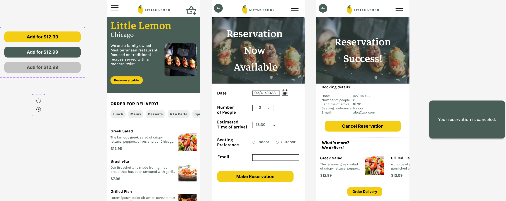

# [Course 7 - Principles of UX/UI Design](https://www.coursera.org/learn/principles-of-ux-ui-design?specialization=meta-front-end-developer)

_This course is part of the [Front-End Development Certificate](https://www.coursera.org/professional-certificates/meta-front-end-developer) offered by Meta._

## Course Summary

- Fundamentals of User Experience (UX) research and design
- Utilize the UX process, from identifying problems, iterating and testing designs to finding appropriate solutions
- Empathize with users through best-practice research approaches
- Create common UX artifacts such as user personas

## Skills

- Create wireframes for features in Figma
- Turn mockups into Minimum Viable Product (MVP) style prototypes
- Evaluate existing interfaces for design consistency and quality
- Identify best practice interaction design methods for improvements
- Create, share and test UX UI designs following best practice guidelines

**Coding assignment results are shown below in screenshots.**

## Week 3 - [Applied Design Fundamentals]()

### Assignment 1 - Design Text and hierarchy and grid

### Assignment 2 - Create wireframe

## Week 4 - [Designing your UI]()

### Assignment 1 & 2 - Interactive component design

Click [here](https://www.figma.com/proto/XXBCdNJvg1wo42LYaHfeKm/wk4-2--Interactive-component-design?node-id=101-3&scaling=min-zoom&page-id=0%3A1) to try out the interaction presented in Figma.

### Assignment 3 - High-fidelity design prototype

Click [here](https://www.figma.com/proto/v0bWiEM4lCXxqaY1jQNZHA/wk4-3--High-fidelity-design-prototype?scaling=min-zoom&page-id=0%3A1&starting-point-node-id=1%3A21&node-id=1-21) to try out the interaction presented in Figma.

## Week 5 - [Final Assessment]()

### Assignment 1 - Problem Statement

The Little Lemon website currrently has no reservation service.

A customer who doesn't like waiting in-line is having trouble with booking tables online
because she cannot find it.
As a result, she rarely dine-in at Little Lemon restaurant.

An online reservation service must be added to enhance customer conviniency and it must be easy to find.

### Assignment 2 - User Persona

### Assignment 3 - Journey Map

### Assignment 4 - Wireframe

### Assignment 5 - Prototype

Click [here](https://www.figma.com/proto/Ao0zVhXD8qZeZE3wS7abkE/wk5-5--prototype?node-id=1%3A36&scaling=min-zoom&page-id=0%3A1&starting-point-node-id=308%3A79) to try out the interaction presented in Figma.
